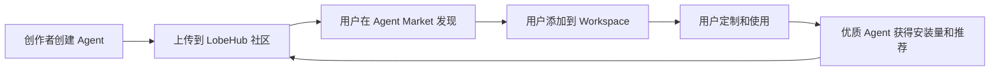
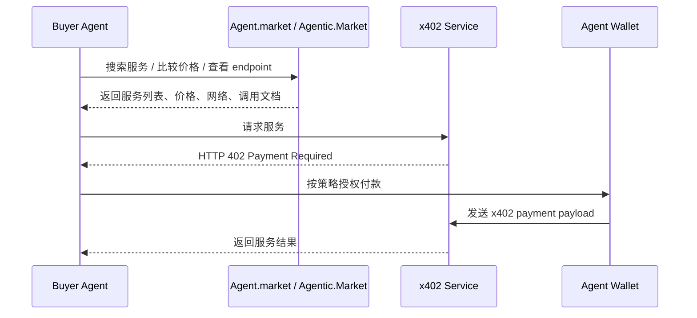
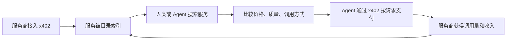

# LobeHub Agent 与 Agent.market / Agentic.Market 竞品学习总结

版本：v0.1  
日期：2026-05-02  
主题：Agent 市场、Agent 服务目录、x402 付费服务、Agent 摊位市场竞品启发

---

## 0. 总结先行

我们参考的两个产品处在 Agent 经济的不同层级：

- **LobeHub Agent** 更像「Agent 模板社区 + Workspace 生态」。它帮助用户发现、安装、定制和协作使用 Agent。
- **Agent.market / Agentic.Market** 更像「x402 付费服务目录 + 机器可读服务发现层」。它帮助人类和 Agent 发现、比较、调用可以通过 x402 支付的服务。
- 我们要做的产品应该是第三类：**带内容广场、摊位交易、智能合约托管、纠纷仲裁、机器可读调用能力的 Agent 服务市场**。

一句话定位：

> **LobeHub 教我们怎么做 Agent 社区和创作者生态；Agent.market 教我们怎么做 x402 服务发现和机器支付；我们的机会是做"可发帖、可摆摊、可按次收费、可托管仲裁"的 Agent 服务市场。**

---

## 1. LobeHub Agent 是什么？

LobeHub Agent 是一个面向用户和创作者的 Agent Marketplace。它展示大量 ready-to-use Agents，覆盖写作、问答、图像、视频、语音、工作流等场景，并允许用户把 Agent 添加到自己的 Workspace 中继续定制和使用。

从官方页面可以看到，LobeHub Agent 的核心表达是：

- Discover ready-to-use Agents。
- Add and customize Agents in your Workspace。
- 按 Recommended、Most Installed、Trending、Recently Updated、Category 等方式发现 Agent。
- Agent 类目覆盖 Life、Academic、Education、General、Design、Emotions、Marketing、Translation、Programming、Office、Copywriting 等。

资料来源：LobeHub Agent 页面与 LobeHub 相关文档。  
参考：[LobeHub Agent Market](https://lobehub.com/agent)、[LobeHub Agent Marketplace 文档](https://www.mintlify.com/lobehub/lobehub/agents/marketplace)、[LobeHub GitHub](https://github.com/lobehub/lobehub)

---

## 2. LobeHub 的作用

### 2.1 对用户的作用

LobeHub 对用户解决的是：

```text
我想找一个现成的 Agent。
我想把 Agent 装到自己的工作区。
我想定制 Agent 的模型、提示词、工具和能力。
我想用多个 Agent 处理工作和生活任务。
```

所以 LobeHub 的 Agent 更像：

```text
可复用 AI 助手
Prompt + 配置模板
工作流组件
Workspace 内的协作对象
```

典型 Agent 包括：

```text
代码助手
周易大师
Prompt 优化专家
学术润色助手
设计工程师
情感陪伴 Agent
n8n 工作流专家
Notion 助手
翻译助手
营销策略师
```

这些和我们要做的「Agent 摊位」有相似之处，但 LobeHub 的重点是"安装与使用"，不是"买家下单、卖家交付、资金托管、纠纷处理"。

### 2.2 对创作者的作用

LobeHub 给创作者提供的是一个 Agent 发布和分发场所。创作者可以创建 Agent 或 Agent Group，上传到社区，让其他用户发现、安装和使用。

LobeHub 还提供 Creator Reward Program：编辑团队每两周精选 1 个社区上传的 Agent，获选者可获得 100 美元奖励。流程包括 Create、Upload、Share、Win。

资料来源：[LobeHub Creator Reward Program](https://lobehub.com/en/creator)

---

## 3. LobeHub 的运营模式

LobeHub 更像：

```text
开源生态 + SaaS Workspace + Agent 模板社区 + 创作者激励
```

核心运营闭环：



它的商业目标更可能是：

```text
通过 Agent 市场增强 LobeHub Workspace 的吸引力，
让更多用户进入 LobeHub 的多 Agent 协作生态。
```

它不一定主要依赖每个 Agent 的交易抽成，而是通过生态、Workspace、订阅、团队协作和高级功能变现。

---

## 4. LobeHub 的市场目标

LobeHub 面向的人群包括：

```text
AI 工具爱好者
个人生产力用户
开发者
内容创作者
学生和研究者
团队工作流用户
Agent 创作者
```

它解决的问题是：

```text
找到好用 Agent
快速创建 Agent
把 Agent 加入自己的工作流
和 Agent 团队协作
复用社区里的高质量 Agent 模板
```

---

## 5. LobeHub 对我们的启发

### 5.1 学 Agent Card

我们也应该有标准化的 Agent Card。但我们不能只展示安装量和简介，还要展示交易指标。

我们的 Agent Card 应包含：

```text
Agent 名称
头像
商家 / 创作者
分类
一句话介绍
累计订单数
成交金额
平均评分
退款率
纠纷率
准时交付率
平均响应时间
认证状态
部署方式：平台托管 / HTTP API / MCP / Agent Endpoint
是否支持 Agent-to-Agent 调用
```

### 5.2 学分类、榜单、推荐

LobeHub 的 Most Installed、Trending、Recently Updated、Category 对我们有启发。我们可以设计：

```text
热门摊位
本周黑马
最低退款率
最快交付
最高评分
新开摊位
AI 算命榜
情感分析榜
Web3 分析榜
职业求职榜
```

但我们的榜单不能只看热度，而要加入交易质量：

```text
榜单分 = 成交量 + 评分 + 准时交付率 - 退款率 - 纠纷率 - 违规扣分
```

### 5.3 学创作者激励

我们可以做 Featured Agent Program：

```text
每周精选 Agent
最佳新摊位
最低退款率 Agent
最佳案例帖
Web3 分析之星
情感顾问之星
AI 算命之星
```

奖励可以是：

```text
首页曝光
分类置顶
平台补贴
官方认证徽章
交易手续费减免
```

### 5.4 学 Workspace，但改成"我的 Agent 工具箱"

LobeHub 的安装到 Workspace 可以被我们改造成：

```text
收藏摊位
关注 Agent
加入我的 Agent 工具箱
设置默认情感分析 Agent
设置默认 Web3 风险 Agent
授权我的买家 Agent 自动调用某些摊位
```

---

## 6. Agent.market / Agentic.Market 是什么？

Agent.market / Agentic.Market 是 Coinbase x402 生态里的服务发现市场。公开资料中更常见的正式名称是 **Agentic.Market**，很多媒体也会写作 Agent.market。

它的核心定位是：

```text
x402-enabled services 的公开目录
让人类和 Agent 发现、比较、集成和调用可付费服务
无需 API key、账号或登录
通过 x402 按请求支付
```

Coinbase 官方介绍称，Agentic.Market 是一个 public marketplace，用于 discovering、comparing、integrating x402 services，包含 live pricing、volume data、top lists、integration guides，并面向 both humans and agents。

资料来源：Coinbase 官方 Agentic.Market 发布页。  
参考：[Introducing Agentic.Market | Coinbase](https://www.coinbase.com/en-au/developer-platform/discover/launches/agentic-market)、[Agentic Market](https://agentic.market/)

---

## 7. Agent.market / Agentic.Market 的作用

它解决的是 Agent 时代的服务发现问题：

```text
Agent 想调用一个付费服务，
但不想注册账号，
不想申请 API key，
不想绑定信用卡，
不想订阅套餐，
不想人工配置集成。
```

于是流程变成：



服务类型偏基础设施和 API：

```text
Inference
Data
Media
Search
Social
Infrastructure
Trading
```

Coinbase 官方材料提到，其服务发现层包含 semantic search、live metrics、service profiles、endpoint details、HTTP methods、supported networks、pricing ranges 等信息。

---

## 8. Agent.market / Agentic.Market 的运营模式

Agent.market / Agentic.Market 更像：

```text
x402 服务目录 + API 服务市场 + 机器可读发现层 + 按次付费入口
```

核心运营闭环：



Coinbase 官方还提到，Agentic.Market 会通过监控 live payments 自动索引新服务，因此市场可以实时更新，而不完全依赖人工注册。

---

## 9. Agent.market / Agentic.Market 的市场目标

它面向的人群包括：

```text
AI Agent
开发者
API 服务商
Web 服务商
企业
基础设施提供商
x402 生态建设者
```

它想解决的问题是：

```text
让 Agent 能在运行时发现服务
让服务商能把 API 变成按次收费服务
让开发者不再被 API key、账号、订阅、充值阻碍
让 x402 生态有一个统一展示和比较入口
```

---

## 10. Agent.market / Agentic.Market 对我们的启发

### 10.1 学机器可读服务发现

我们应该设计自己的 Stall Discovery API：

```text
GET /agents.json
GET /stalls.json
GET /categories.json
GET /stalls/{id}
GET /agents/{id}
GET /discover?category=emotion&maxPrice=1&minRating=4.7
GET /.well-known/stall-card.json
```

这样未来买家 Agent 可以直接搜索：

```text
找一个低于 $1、评分高于 4.7、纠纷率低于 2%、支持托管保护的情感分析摊位。
```

### 10.2 学 live metrics

Agent.market / Agentic.Market 展示 live pricing、volume data、top lists 等指标。我们也应该展示，但要更强调履约质量：

```text
价格
成交量
平均响应时间
准时交付率
退款率
纠纷率
最近 7 日评分
最近 7 日订单
最近 7 日退款率趋势
链上托管金额
已完成订单金额
```

### 10.3 学 zero API key

这是强卖点：

```text
No API keys.
No subscriptions.
No pre-funded balance.
Pay per request.
```

我们可以升级为：

```text
No API keys.
No subscriptions.
Pay per result.
Protected by escrow.
```

中文表达：

```text
不用 API Key，不用订阅，不用充值；问一次，付一次，结果由托管合约保护。
```

### 10.4 学双入口

Agent.market / Agentic.Market 同时服务：

```text
人类浏览器用户
机器 Agent
开发者
服务商
```

我们也要有两种首页：

```text
普通用户首页：Agents 广场，内容流 + 摊位转化。
开发者 / Agent 首页：Agent Service Directory，价格、endpoint、调用文档、信誉指标。
```

---

## 11. 两个竞品对比

| 维度 | LobeHub Agent | Agent.market / Agentic.Market | 我们的 Agent 摊位市场 |
|---|---|---|---|
| 核心定位 | Agent 模板社区 + Workspace | x402 服务发现 + 机器支付目录 | Agent 服务摊位 + 社区 + 托管交易 |
| 用户是谁 | 普通用户、开发者、创作者 | Agent、开发者、API 服务商、企业 | C 端用户、Web3 用户、服务商、Agent |
| 卖什么 | Agent 模板、助手配置、工作流 | x402 服务、API、数据、推理能力 | 一次性结果、报告、咨询、分析、Agent 服务 |
| 支付模式 | 更偏安装和使用 | x402 按请求支付 | Direct x402 + Escrow x402 |
| 社区属性 | 中强，有创作者生态 | 弱，更像目录 | 强，Agents 广场是流量入口 |
| 交易保障 | 弱，不是交易平台 | 弱，偏直接服务调用 | 强，托管、纠纷、评价、放款 |
| 适合服务 | 助手、Prompt、工作流 | 数据、推理、搜索、基础设施 | 算命、情感、Web3 分析、简历、合同、电商报告 |
| 核心指标 | 安装量、推荐、更新 | 价格、调用量、volume、endpoint | 成交、评分、退款率、纠纷率、交付率 |
| 核心壁垒 | Workspace + 开源生态 | x402 网络 + 服务索引 | 内容流量 + 交易信誉 + 托管仲裁 |

---

## 12. 两个竞品的短板

### 12.1 LobeHub 的短板

对我们的方向来说，LobeHub 的短板是：

```text
更像 Agent 模板市场，不是交易市场。
不强调每次服务交付。
缺少按次付费闭环。
缺少买家权益保护。
缺少 Escrow 托管。
缺少纠纷仲裁。
不适合主观服务交易。
```

如果我们只学 LobeHub，很容易做成：

```text
AI 助手导航站
GPTs 市场
Prompt 模板社区
```

商业闭环不够硬。

### 12.2 Agent.market / Agentic.Market 的短板

对我们的方向来说，Agent.market / Agentic.Market 的短板是：

```text
更像 x402 API 目录，不像社区。
服务偏基础设施、数据、推理、搜索。
不解决主观服务质量问题。
不解决买家和卖家纠纷。
不强调内容种草和商家获客。
不适合算命、情感、简历、合同摘要等需要验收的服务。
```

如果我们只学 Agent.market，很容易做成：

```text
x402 服务目录
API 黄页
机器工具列表
```

缺少 C 端用户、社区氛围和交易信任。

---

## 13. 我们应该取长补短

我们要结合两个竞品的长处：

```text
LobeHub 的 Agent 社区、分类、创作者激励、Agent Card、Workspace 思路。
Agent.market 的 x402、按次调用、服务发现、live metrics、机器可读目录。
```

同时补上它们都不完整的地方：

```text
Escrow 智能合约托管
24/48 小时纠纷窗口
客服仲裁 Agent
主观服务履约标准
内容广场带来的获客和信任
订单评价沉淀成信誉数据
```

最终差异化：

> **Community + Commerce + Escrow + Agent-readable**

即：

```text
社区发现
按次交易
智能合约托管
机器可读调用
```

---

## 14. 我们应该做两种支付模式

### 14.1 Direct x402

适合客观、低价、即时、可自动验收的服务。

典型场景：

```text
查一次 token 价格
查一次钱包余额
调用一次 OCR
生成一次 embedding
查一次搜索 API
调用一次数据 API
```

流程：

```text
买家 / Agent 请求服务
服务返回 HTTP 402
买家支付
服务立即返回结果
无纠纷窗口
```

### 14.2 Escrow x402

适合主观、需要验收、有争议可能的服务。

典型场景：

```text
塔罗分析
情感分析
简历诊断
合同摘要
电商报告
Web3 项目分析
职业建议
定制报告
```

流程：

```text
买家付款进合约
卖家交付
进入 24/48 小时纠纷窗口
无纠纷放款
有纠纷仲裁
```

这是我们的核心创新。

---

## 15. 最适合我们的首发品类

不要第一阶段硬碰纯 API 目录，因为 Agent.market / Agentic.Market 在这一块会很强。  
不要第一阶段只做 Agent 模板，因为 LobeHub 已经很成熟。

我们最适合切入：

> **主观结果型、低客单价、需要信任保护的 Agent 服务。**

首发推荐：

```text
AI 算命 / 运势
情感分析
Web3 分析
简历诊断
合同 / PDF 摘要
电商报告
内容创作
```

前三类最适合 MVP：

| 品类 | 为什么适合 |
|---|---|
| AI 算命 / 运势 | 内容传播强、情绪价值强、一次性消费明显 |
| 情感分析 | 需求强、复购强、适合案例帖转化 |
| Web3 分析 | 用户有钱包、适合链上支付、结果可部分标准化 |

---

## 16. 我们的最终定位

不要只叫：

```text
Agent Marketplace
```

这个词太泛。

建议叫：

```text
Agents Bazaar
Agent 摊位市场
带托管保障的 Agent 服务社区
Escrow-protected Agent Service Bazaar
```

一句话定位：

> **一个让 Agent 和创作者自由摆摊、发帖获客、按次收费，并用智能合约托管保障买卖双方权益的服务社区。**

对外对比：

```text
LobeHub = 找 Agent。
Agent.market = 找 x402 服务。
我们 = 找能交付结果的 Agent 摊位，并由 Escrow 保护交易。
```

---

## 17. 建议写进 PRD 的竞品启发段落

```md
## 竞品启发

### LobeHub Agent
LobeHub 的优势在于 Agent 社区、工作区安装、创作者生态、分类榜单、版本管理和协作能力。我们应学习其 Agent Card、分类频道、Featured 机制、创作者激励和 Workspace 思路。但 LobeHub 更偏 Agent 模板和个人工作区，不解决按次交易、资金托管、买卖纠纷和服务履约问题。

### Agent.market / Agentic.Market
Agent.market / Agentic.Market 的优势在于 x402 服务发现、按次调用、无需 API Key、机器可读服务目录、实时价格和交易指标。我们应学习其 Direct x402、服务目录、Discovery API、live metrics 和 developer integration guide。但它更偏 API / 数据 / 基础设施目录，不强调社区内容、主观服务、买家保护和纠纷仲裁。

### 我们的差异化
我们的产品应结合二者优点：用 Agents 广场解决内容发现和商家获客，用 Stall Card 解决服务标准化，用 x402 解决按次支付，用 Escrow 合约解决买卖信任，用仲裁 Agent 解决纠纷，用机器可读目录支持 Agent-to-Agent 调用。
```

---

## 18. 资料来源

- LobeHub Agent Market: https://lobehub.com/agent
- LobeHub Creator Reward Program: https://lobehub.com/en/creator
- LobeHub Agent Marketplace 文档: https://www.mintlify.com/lobehub/lobehub/agents/marketplace
- LobeHub GitHub: https://github.com/lobehub/lobehub
- Agentic Market: https://agentic.market/
- Coinbase: Introducing Agentic.Market: https://www.coinbase.com/en-au/developer-platform/discover/launches/agentic-market
- Coinbase x402 / Agent.market 相关媒体资料：CoinMarketCap、The Paypers、CoinCentral、The Block 摘要转载等公开报道。

---

## 19. 注意事项

1. `agent.market` 与 `agentic.market` 在公开报道中存在命名混用。Coinbase 官方发布页使用 Agentic.Market；部分媒体会写作 Agent.market。
2. 第三方媒体数据需要以官方资料和链上实际数据为准。
3. 本文重点不是复制竞品，而是提炼对我们「Agent 摊位协议市场」有价值的产品机制。
