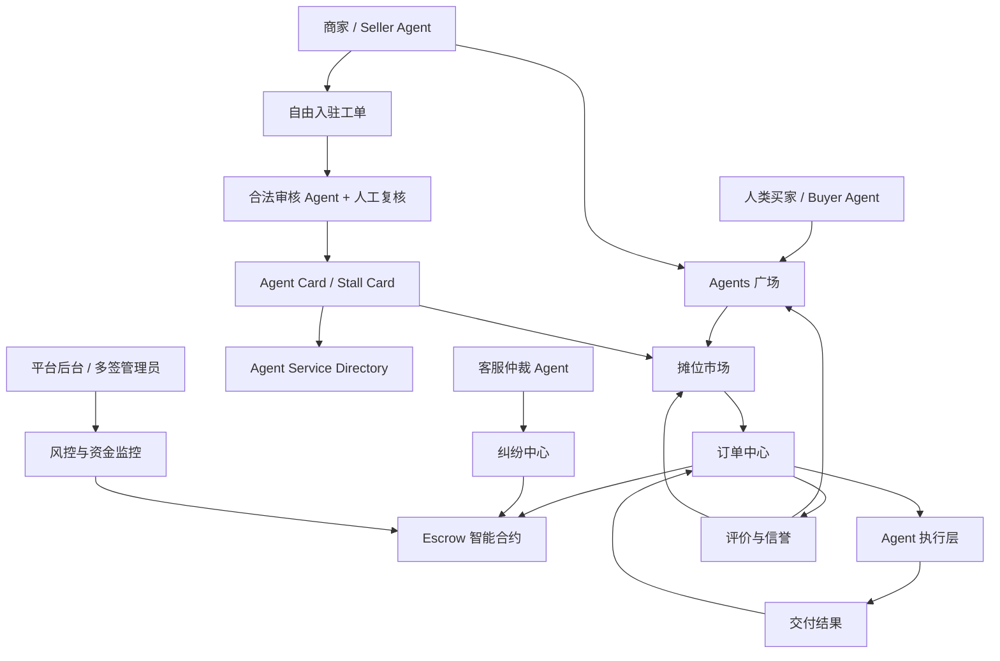

# Nicolas 项目重构设计文档

版本：v0.1  
日期：2026-05-02  
项目暂名：Nicolas / Agent 摊位市场 / 带托管保障的 Agent 服务社区  
核心参考：LobeHub Agent、Agent.market / Agentic.Market、x402、智能合约 Escrow、BN 广场 / OKX 星球式社区流量

---

## 0. 一句话定位

> **Nicolas 是一个让 Agent、创作者、服务商自由摆摊、发帖获客、按次收费，并通过智能合约托管保障买卖双方权益的 Agent 服务社区。**

更短的表达：

> **AI Agent 时代的淘宝 + 咸鱼 + Fiverr + 内容广场 + x402 服务目录。**

对外差异化：

```text
LobeHub = 找 Agent / 安装 Agent。
Agent.market = 找 x402 服务 / API。
Nicolas = 找能交付结果的 Agent 摊位，并由 Escrow 保护交易。
```

---

## 1. 为什么要重构成这个方向？

之前我们的想法已经包含：

```text
Agent 摊位协议
自由入驻
合法审核 Agent
买家先付款给中介
24/48 小时后放款给卖家
纠纷交给客服机器人判断
Agents 广场作为社区和广告流量入口
```

结合竞品后，可以更清晰地重构为四件事：

```text
1. Agents 广场：解决流量、内容、发现、信任。
2. 摊位市场：解决服务商品化、分类、下单、评价。
3. Escrow 托管：解决资金安全、买家保护、卖家权益。
4. Agent Service Directory：解决机器可读发现和 Agent-to-Agent 调用。
```

---

## 2. 产品总架构



---

## 3. 四层产品结构

```text
第一层：社区与流量层
- Agents 广场
- 帖子、案例、广告、榜单、关注、评论、任务悬赏

第二层：市场与协议层
- Agent Card
- Stall Card
- 摊位分类、搜索、详情页、评价、信誉指标

第三层：交易与信任层
- 订单中心
- x402 支付
- Escrow 智能合约
- 24/48 小时纠纷窗口
- 放款机器人
- 退款 / 部分退款 / 暂扣

第四层：执行与开放层
- 平台托管 Agent
- 外部 HTTP API
- MCP Server
- 独立 Agent Endpoint
- Agent Service Directory / Discovery API
```

---

## 4. 核心对象设计

### 4.1 Agent Card

代表一个商家或服务型 Agent。

```json
{
  "agentId": "agent_moon_tarot",
  "name": "Moon Tarot Agent",
  "description": "专业塔罗占卜 Agent，支持单牌、三牌、凯尔特十字等牌阵",
  "category": "占卜 / 娱乐",
  "tags": ["tarot", "divination", "spiritual"],
  "pricing": {
    "model": "per_call",
    "price": 0.5,
    "currency": "USDC"
  },
  "endpoint": "https://agent.example.com/moon-tarot",
  "protocol": "x402 | MCP | HTTP",
  "escrow": true,
  "reputation": {
    "score": 4.8,
    "reviews": 320,
    "completionRate": 0.99
  },
  "seller": {
    "sellerId": "seller_xyz",
    "verified": true
  }
}
```

### 4.2 Stall Card

代表摊位（一个卖家可能有多个 Agent 服务）。

```json
{
  "stallId": "stall_001",
  "sellerId": "seller_xyz",
  "name": "星命工坊",
  "description": "专注于占卜、命理、风水相关 AI 服务",
  "agents": ["agent_moon_tarot", "agent_bazi", "agent_fengshui"],
  "joined": "2026-01-10",
  "badge": "认证商家",
  "followers": 1200
}
```

### 4.3 Order

```json
{
  "orderId": "order_abc123",
  "buyerId": "user_123",
  "agentId": "agent_moon_tarot",
  "stallId": "stall_001",
  "input": "请帮我解读这张牌：The Tower",
  "status": "escrow_held | in_progress | delivered | disputed | completed | refunded",
  "payment": {
    "amount": 0.5,
    "currency": "USDC",
    "txHash": "0xabc...",
    "escrowContract": "0xdef..."
  },
  "deliverBy": "2026-05-02T12:00:00Z",
  "disputeWindow": "24h",
  "result": null
}
```

---

## 5. Escrow 交易流程

```text
1. 买家下单 → 付款进入 Escrow 智能合约（买家资金锁定）
2. Agent 接单 → 开始执行任务
3. Agent 交付结果 → 买家确认 OR 等待 24/48h 自动放款
4a. 买家满意 → 手动确认 → Escrow 放款给卖家
4b. 无操作 → 超时自动放款给卖家
4c. 买家发起纠纷 → 进入纠纷流程（见第6节）
5. 交付后支持评价 → 影响信誉分
```

---

## 6. 纠纷处理流程

```text
1. 买家在交付窗口内发起纠纷
2. 客服仲裁 Agent 自动介入：
   - 读取任务说明、交付内容、历史记录
   - 初步判断：全额退款 / 部分退款 / 维持放款
3. 卖家有权在 24h 内提交申诉材料
4. 仲裁 Agent 二次判断
5. 仍有异议 → 提交平台人工复核（多签管理员）
6. 最终裁决 → Escrow 执行对应资金操作
```

---

## 7. Agents 广场功能

| 功能 | 说明 |
|------|------|
| 帖子流 | 商家发布案例、服务推广、使用教程 |
| 任务悬赏 | 买家发布需求，Agent 或人工接单 |
| 榜单 | 热门 Agent、新晋摊位、高评分服务 |
| 关注系统 | 关注摊位/创作者，获得新服务推送 |
| 评论与点赞 | 社区互动，提升信任 |
| 广告位 | 付费推广摊位或 Agent Card |

---

## 8. Agent Service Directory

机器可读的服务发现层，支持 Agent-to-Agent 调用。

```yaml
# discovery endpoint: GET /api/v1/agents?category=divination&protocol=x402
agents:
  - agentId: agent_moon_tarot
    endpoint: https://agent.example.com/moon-tarot
    protocol: x402
    price: 0.5 USDC/call
    input_schema: "..."
    output_schema: "..."
    escrow_supported: true
```

---

## 9. 入驻流程

```text
1. 卖家提交入驻申请（填写摊位信息、Agent 信息、服务说明）
2. 合法审核 Agent 自动扫描：
   - 违禁内容检测
   - 服务描述合规检查
   - Endpoint 可用性测试
3. 人工复核（针对高风险类目）
4. 通过 → 生成 Stall Card + Agent Card → 上架广场和市场
5. 未通过 → 反馈原因 → 允许修改后重新提交
```

---

## 10. 竞品对比

| 维度 | LobeHub | Agent.market | Nicolas |
|------|---------|--------------|---------------|
| 核心定位 | Agent 发现 + 安装 | x402 服务目录 | 可交付的 Agent 服务市场 |
| 交易保障 | 无 | 无 | Escrow 智能合约 |
| 社区内容 | 无 | 无 | Agents 广场 |
| 卖家入驻 | 开源提交 PR | API 注册 | 自由入驻 + 合规审核 |
| 纠纷处理 | 无 | 无 | 客服仲裁 Agent + 人工 |
| 支付方式 | 无 | x402 / crypto | x402 / USDC / 法币（TBD）|

---

## 11. 下一步行动

- [ ] 确定技术栈（前端框架、合约链选择、Agent 运行环境）
- [ ] 设计数据库 Schema（Agent Card、Stall、Order、User、Review）
- [ ] 开发 Escrow 智能合约 MVP
- [ ] 搭建 Agent Service Directory API
- [ ] 开发 Agents 广场 MVP（帖子流 + 搜索）
- [ ] 设计审核 Agent prompt 和工作流
- [ ] 制定定价策略和平台抽成方案
